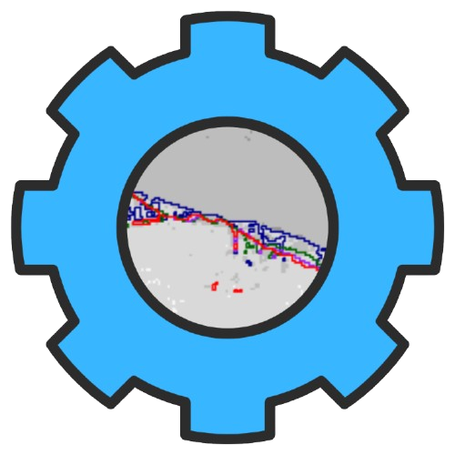

# Shoreline Change Analysis



## Description

This [**Quatro**](Shoreline_Change_Analysis.qmd) workflow performs shoreline change analysis using raster data for different years. The workflow involves loading raster data, calculating the Normalized Difference Water Index (NDWI), applying masking, converting the raster data into polygons, and visualizing the shoreline changes over time.

## Key Features

-   **Load** raster files for the years 1994, 2004, 2014, and 2024.
-   Calculate the **Normalized Difference Water Index (NDWI)** for each year’s raster.
-   Generate land-water **masks** from the NDWI data.
-   **Convert** the land-water masks to vector polygons for more precise spatial analysis.
-   **Visualize** the shorelines for each year on a base map for comparison.

## Requirements

-   Required libraries:
    -   `terra`
    -   `sf`
    -   `tmap`

You can install the required packages using:

``` r
install.packages(c("terra", "sf", "tmap"))
```

## Further Development

-   **Coastline Rates Calculation**\
    Develop a method to calculate coastline change rates over time, providing insights into the speed and extent of shoreline erosion or accretion.
-   **Predictive Modeling for Shoreline Analysis**\
    Implement machine learning or statistical models to predict future shoreline changes based on historical data, environmental factors, and climate scenarios.

## Notes

Modify the file paths according to where your data is stored. This analysis assumes that the raster data is already pre-processed and aligned.

## AI Disclaimer

AI is used in this workflow to assist with data processing and analysis.
